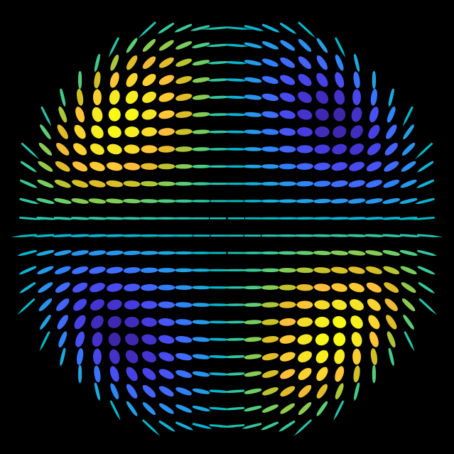

# PolLib

MATLAB library for modelling polarisation effects in optics.

## References
<a id="1">[1] He, Chao, Jacopo Antonello, and Martin J. Booth. "Vectorial adaptive optics." arXiv preprint [arXiv:2110.02606](https://doi.org/10.48550/arXiv.2110.02606) (2021).</a>
